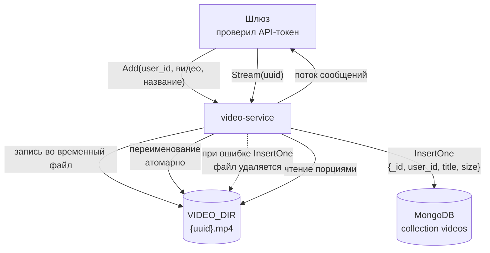

# video-service

gRPC-сервис хранения и выдачи видео для системы видеохостинга. Файлы лежат на
диске, MongoDB хранит только описание.

Контракт: [grpc-contract](https://github.com/nikaydo/grpc-contract) ·
потребитель: [video-platform](https://github.com/nikaydo/video-platform)

## Что делает

| Метод | Назначение |
|---|---|
| `Add` | Сохраняет видео и его описание |
| `Get` | Возвращает список видео пользователя по названию |
| `Delete` | Удаляет описание и файл. Требует идентификатор владельца |
| `Stream` | Отдаёт видео **потоком** сообщений |

## Стек

Go 1.24 · gRPC · MongoDB 8 · `mongo-driver` · `caarlos0/env` · slog · Docker ·
GitHub Actions

## Запуск

```bash
git clone https://github.com/nikaydo/video-service.git
cd video-service

# 1. Конфигурация
cp .env.example .env
# Заполнить MONGODB_URI

# 2. Запуск
docker compose up --build
```

Сервис поднимается на `localhost:50053`, каталог хранения создаётся при старте.

## Конфигурация

| Переменная | По умолчанию | Назначение |
|---|---|---|
| `MONGODB_URI` | — | Строка подключения к MongoDB |
| `MONGODB_NAME` | `video` | Имя базы |
| `VIDEO_DIR` | `./storage/video` | Каталог хранения файлов |
| `HOST` / `PORT` | `0.0.0.0` / `50053` | Адрес gRPC-сервера |
| `MAX_MESSAGE_BYTES` | `26214400` | Предел входящего сообщения (25 МиБ) |
| `MAX_VIDEO_BYTES` | `20971520` | Предел размера видео (20 МиБ) |
| `STREAM_CHUNK_BYTES` | `65536` | Порция при потоковой передаче |
| `TAG_LIMIT` | `20` | Сколько меток можно задать |
| `SHUTDOWN_TIMEOUT` | `30s` | Ожидание при остановке |

## Как устроено хранение



Видео не хранится в документе MongoDB: файл лежит на диске, база хранит
только описание. Это дешевле и позволяет отдавать видео потоком, не загружая
его в память целиком.

## Решения и их цена

### Имя файла строится только из UUID

Путь к файлу — `VIDEO_DIR/{uuid}.mp4`, где `uuid` сгенерирован сервером.

Раньше путь строился конкатенацией: `PATH_VIDEO + req.Uuid + ".mp4"`, то есть
значение из запроса попадало в путь напрямую. Последовательность вида
`../../etc/passwd` позволяла прочитать любой файл на сервере. Теперь
идентификатор проверяется на соответствие UUID, а название из запроса в имя
файла не попадает — только в метаданные.

*Цена:* один пользователь не может задать собственное имя файла. Если это
требуется, имя нужно хранить отдельно от пути, а путь строить исключительно из
идентификатора.

### Потоковая передача вместо целого сообщения

`Stream` возвращает `stream StreamResponse` и читает файл порциями по 64 КиБ.
Раньше метод был обычным: он загружал файл целиком в память и отдавал одним
сообщением, что ограничивало размер видео размером одного сообщения gRPC.

Размер порции уменьшается, если он превышает предел сообщения, — иначе
последнее сообщение не прошло бы и передача оборвалась бы.

*Цена:* клиенту нужно собирать файл из сообщений. Это обычная практика для
видео: так работают, например, HTTP-диапазонные запросы.

### Запись через временный файл

Файл сначала пишется во временное имя и затем переименовывается. Переименование
в пределах одного каталога атомарно, поэтому читатель никогда не увидит
наполовину загруженный файл.

Если сохранение описания в MongoDB не удалось, файл удаляется: иначе на диске
останется видео, о котором никто не знает, и оно никогда не будет показано
при очистке.

*Цена:* на диске временно появляется файл с именем `.upload-*`. Если процесс
убьют во время загрузки, он останется; его нужно убирать отдельной процедурой
обслуживания.

### Проверка владельца в MongoDB

`user_id` участвует в условии `find` и `deleteOne`. Поле `user_id` добавлено в
контракт: раньше передавался сам API-токен, сервис его сохранял, а поиск шёл
**только по названию** — одноимённые видео разных пользователей смешивались, и
любой мог удалить чужое видео по одному uuid.

*Цена:* токен проверяет шлюз, а не сервис. Если шлюз вызовет `Delete` напрямую
с чужим `user_id`, ничего не помешает — доверие между сервисами.

### Права на файлы

Файлы создаются с правами `0600`. Раньше ставились `0644`, из-за чего видео было
доступно на чтение всем пользователям системы.

*Цена:* файл недоступен, если сервис запущен от другого пользователя, чем
тот, который читает его вручную. Это осознанно: доступ к видео — через сервис.

### Предел размера

`MAX_VIDEO_BYTES` ограничивает размер одного файла. Запись идёт через
`io.LimitReader`, поэтому превышение обнаруживается по ходу, а не после того,
как диск заполнен.

*Цена:* видео длиннее лимита не загрузится. Увеличение требует поднятия и
`MAX_MESSAGE_BYTES`, иначе запрос не пройдёт по размеру сообщения.

## Тесты

```bash
task test    # модульные, с -race
task cover   # отчёт о покрытии
```

Основной тест — `TestPathTraversalIsRejected`: он проверяет, что значения вида
`../../etc/passwd` и `/etc/passwd` отклоняются и файл вне каталога хранилища
остаётся нетронутым. Остальные тесты покрывают запись, удаление, права на
файлы, разбиение на порции и разбор конфигурации.

Интеграционные тесты с MongoDB не написаны: проверяется в основном работа с
файловой системой, которую тесты покрывают полностью.

## Ограничения

- Нет транскодирования: файл отдаётся в том виде, в каком загружен
- Нет проверки содержимого: mime-тип не определяется, расширение всегда `.mp4`
- Нет очистки осиротевших файлов после сбоя во время загрузки
- Нет ограничения суммарного объёма на пользователя

## Лицензия

MIT — см. [LICENSE](LICENSE).